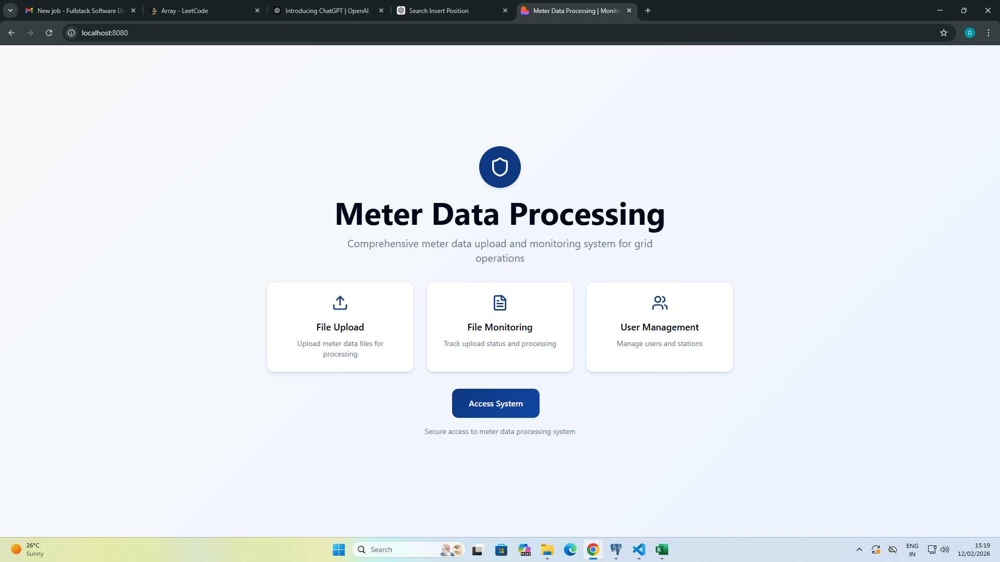
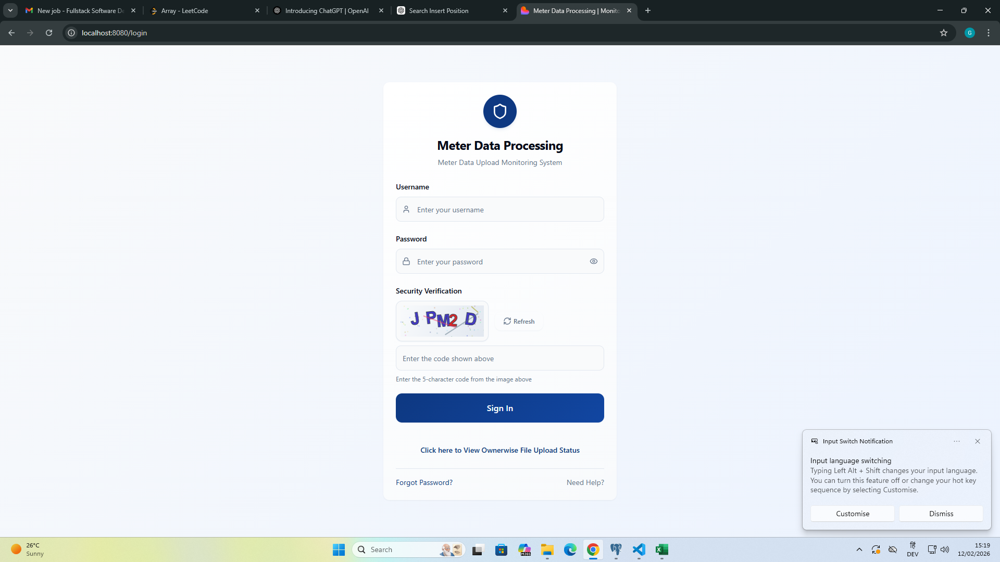
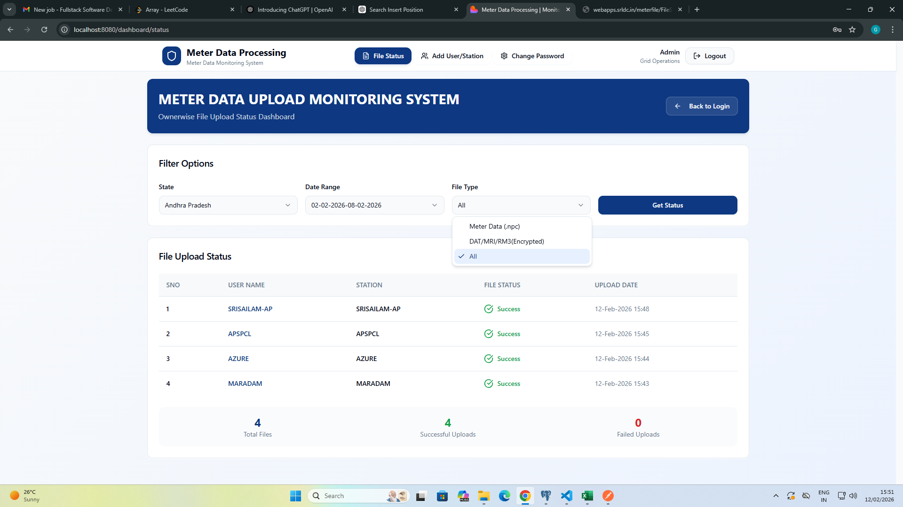
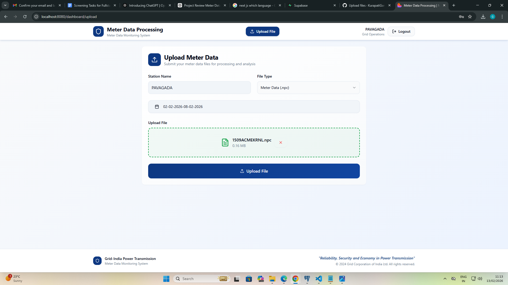
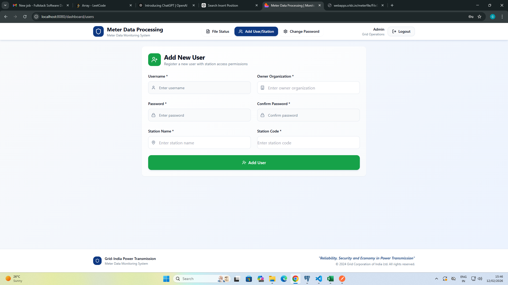
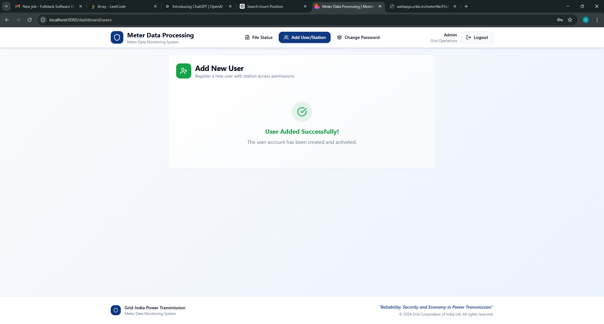

# ⚡ Meter Data File Upload System

A role-based web application designed for secure weekly electricity meter data uploads. The system enables controlled file submission, station-wise access management, and administrative monitoring.

---

## 🚀 Tech Stack

**Frontend:** React, Axios  
**Backend:** Django (REST APIs)  
**Database:** PostgreSQL  
**API Testing:** Postman  
**Language:** Python,Javascript

---

## 📌 Features

### 🔐 Role-Based Access Control (RBAC)
- **Admin Users**
  - Manage all stations
  - View all uploaded files
  - Monitor users and uploads
- **Basic Users**
  - Upload files only for their assigned station
  - Restricted access to other stations

### 📂 File Upload System
- Supports file formats:
  - `.npc`
  - `.dat`
  - `.mri`
  - `.rm3`
- Drag-and-drop file upload interface
- Real-time upload progress tracking
- File type validation
- Secure backend file storage

### 🏢 Station Management
- Create and manage stations (Admin only)
- Assign users to specific stations
- Restrict file access based on station mapping

---

## 🏗️ System Architecture

Frontend (React)
⬇️
Axios API Calls
⬇️
Django REST APIs
⬇️
PostgreSQL Database + File Storage

---

## 🛡️ Security Implementations
- Role-based access control
- File type validation
- Station-level access restriction
- Authenticated API endpoints

---

## 📊 Future Enhancements
- JWT Authentication
- File size limit validation
- Upload logging system
- Background processing (Celery)
- Docker deployment
- Cloud storage integration (AWS S3)

---

## 📷 Screenshots
### Home Page

### Login Page

### File Status

### File Upload

### Station Registration

### Registration Status

---

⭐ If you found this project helpful, consider giving it a star on GitHub!

